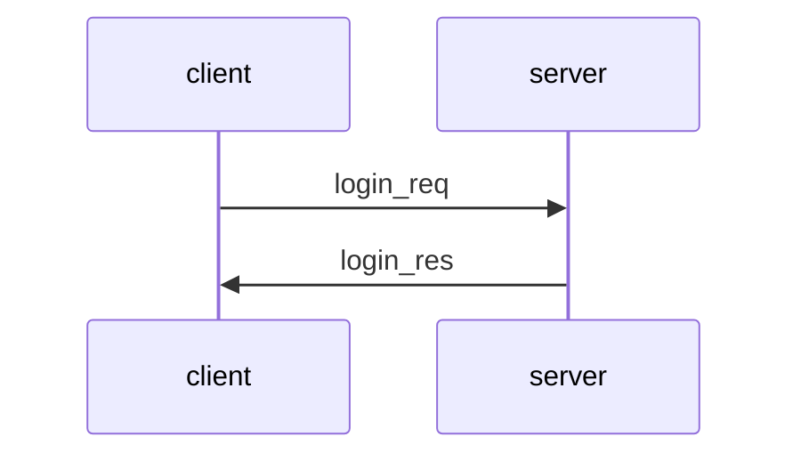
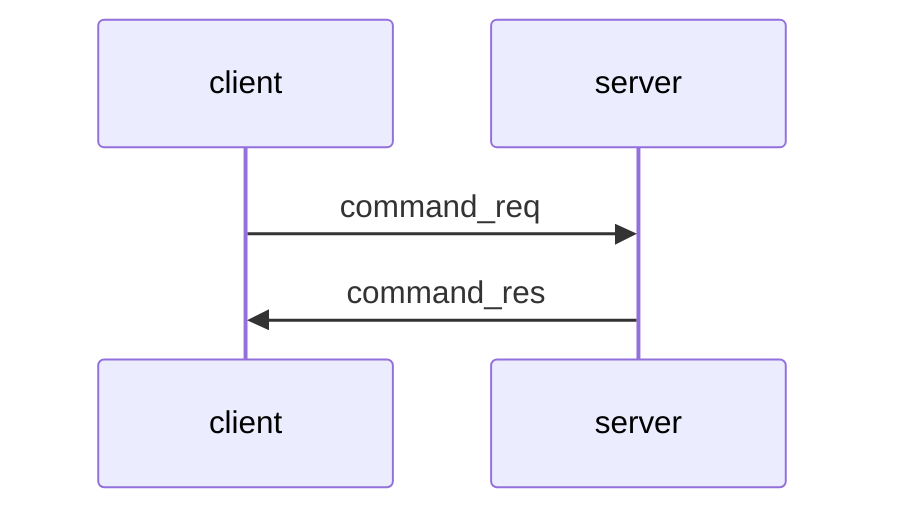
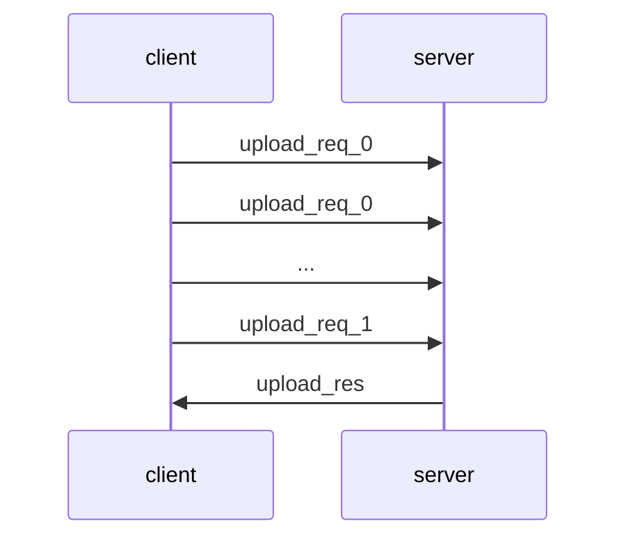
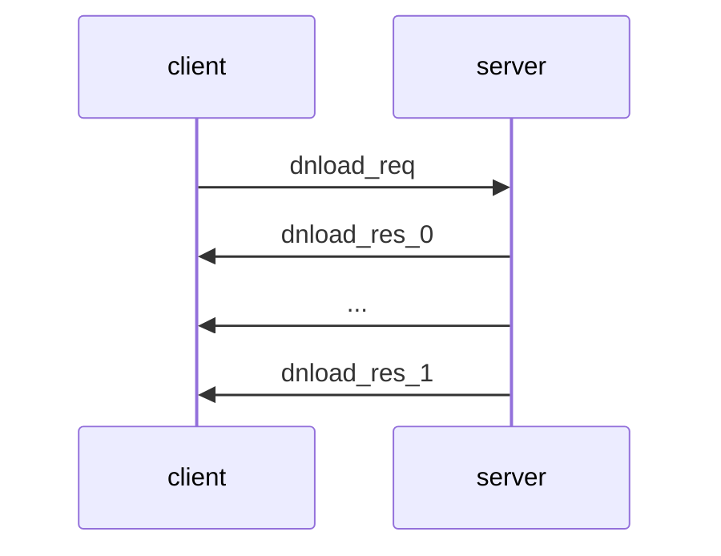

# Simple File Transfer v1.0

This document specifies version 1.0 of the Simple File Transfer (SiFT) protocol. SiFT can be used by a client to send file commands to a server, which executes those commands. SiFT supports the following 7 commands:

- __pwd__ --> Print current working directory: Returns to the client the name of the current working directory on the server.
- __lst__ --> List content of the current working directory: Returns to the client the list of files and directories in the current working directory on the server. 
- __chd__ --> Change directory: Changes the current working directory on the server. The name of the target directory is provided as an argument to the chd command.
- __mkd__ --> Make directory: Creates a new directory on the server. The name of the directory to be created is provided as an argument to the mkd command.
- __del__ --> Delete file or directory: Deletes a file or a directory on the server. The name of the file or directory to be deleted is provided as an argument to the del command.
- __upl__ --> Upload file: Uploads a file from the client to the server. The name of the file to be uploaded is provided as an argument to the upl command and the file is put in the current working directory on the server.
- __dnl__ --> Download file: Downloads a file from the current working directory of the server to the client. The name of the file to be downloaded is provided as an argument to the dnl command.

SiFT allows the client and the server to communicate via a network and execute the above commands remotely. It assumes that the client and the server uses the TCP/IP protocol to establish a connection and to send data reliably to each other. By reliability, we mean that the bytes sent by a party arrive to the other party, and they arrive in the order that they were sent. The SiFT v1.0 server must listen and accept client connection requests on TCP port 5150.

On the other hand, unlike earlier versions, SiFT v1.0 does not assume that the network is secure, which means that an attacker may eavesdrop, modify, delete, and replay messages sent by the parties, and the attacker may also inject new messages. SiFT provides protection against these misdeeds by using a cryptographically secured message transfer sub-protocol. This sub-protocol uses symmetric key cryptographic primitives, and hence, needs shared secret keys. SiFT uses a login sub-protocol to establish the needed secret keys and to authenticate the client and the server to each other. In the sequel, we specify these (and other) sub-protocols of SiFT v1.0.

## Overview of sub-protocols

SiFT v1.0 has the following sub-protocols: Message Transfer Protocol (MTP), Login Protocol, Commands Protocol, Upload Protocol, and Download Protocol. The following figure shows how these sub-protocols are related to each other: 

```
  +--------------+  +-----------------+  +---------------+  +-----------------+
  |Login Protocol|  |Commands Protocol|  |Upload Protocol|  |Download Protocol|
  +--------------+  +-----------------+  +---------------+  +-----------------+
  +---------------------------------------------------------------------------+
  |                     Message Transfer Protocol (MTP)                       |
  +---------------------------------------------------------------------------+
```

SiFT messages are carried by the Message Transfer Protocol (MTP), which provides cryptographic protection to them. Messages are encrypted, their integrity is protected, and sequence numbers are used to detect replay attacks. MTP uses symmetric key cryptographic primitives, which require secret keys shared between the client and the server. These keys are established by the Login Protocol.

The Login Protocol is used to authenticate the parties to each other and to establish the secret key between the client and the server to be used by MTP. The server is authenticated implicitly by requiring it to use its private key, whereas the client authenticates itself to the server by sending a username and a password to it. The secret key intended for MTP is derived from random numbers that the client and the server exchange in the Login Protocol.  As this secret key is established by the Login Protocol, the messages of the Login Protocol itself cannot be protected by it. Hence, MTP uses a temporary key when executing the Login Protocol, which is replaced by the key established by the Login Protocol when it is completed. The temporary key is generated by the client and it is sent to the server in a login request message, which is encrypted with the server's public key.

After the Login Protocol, the Commands Protocol is used to send file commands of the client to the server and responses to those commands. Moreover, the upload command is followed by the execution of the Upload Protocol, which is responsible for the actual upload of the selected file to the server, and the download command is followed by the execution of the Download Protocol, which is responsible for the actual download of the selected file from the server.

## SiFT v1.0 Message Transfer Protocol 

The SiFT v1.0 Message Transfer Protocol (MTP) uses cryptography to encrypt SiFT messages (i.e., commands and their arguments sent by the client to the server and the server's responses to them, as well as the files that are uploaded to or downloaded from the server), to protect their integrity, and to ensure their authenticity. MTP also uses sequence numbering of messages to protect against replay attacks. 

More specifically, SiFT v1.0 MTP uses AES in GCM mode, which provides encryption, integrity protection, and origin authentication of messages. The AES-GCM authentication tag covers the message sequence number (along with all other fields of the message header and the encrypted message payload), which is explicitly put in the message header (i.e., explicit sequence numbering is used). AES-GCM requires a symmetric key, which is established by the SiFT v1.0 Login Protocol (to be described later in this document).

### Message formats

All SiFT v1.0 MTP messages (except when the payload is a login request) has the following format:

```
	+---+---+---+---+---+---+---+---+---+---+---+---+---+---+---+---+
	|  ver  |  typ  |  len  |  sqn  |          rnd          |  rsv  |
	+---+---+---+---+---+---+---+---+---+---+---+---+---+---+---+---+
	|                                                               |
	+                                                               +
	|                                                               |
	.                                                               .
	.                    encrypted payload (epd)                    .
	.                                                               .
	|                                                               |
	+                                                               +
	|                                                               |
	+               +---+---+---+---+---+---+---+---+---+---+---+---+
	|               |                      mac                      |
	+---+---+---+---+---+---+---+---+---+---+---+---+---+---+---+---+
```

SiFT v1.0 MTP messages have a 16-byte header that consists of the following fields:

- __ver__: A 2-byte _version number_ field, where the first byte is the major version (i.e., 1 in case of v1.0) and the second byte is the minor version (i.e., 0 in case of v1.0). This means that messages conforming this specification must start with the byte sequence `01 00`.
- __typ__: A 2-byte _message type_ field that specifies the type of the payload in the message. The following message types are supported by SiFT v1.0:
	- `00 00` : _login_req_ (login request)
	- `00 10` : _login_res_ (login response)
	- `01 00` : _command_req_ (command request)
	- `01 10` : _command_res_ (command response)
	- `02 00` : _upload_req_0_ (upload request containing a file fragment)
	- `02 01` : _upload_req_1_ (upload request containing the last file fragment)
	- `02 10` : _upload_res_ (upload response)
	- `03 00` : _dnload_req_ (download request)
	- `03 10` : _dnload_res_0_ (download response containing a file fragment)
	- `03 11` : _dnload_res_1_ (download response containing the last file fragment)
- __len__: A 2-byte _message length_ field that contains the length of the entire message (including the header) in bytes (using big endian byte order).
- __sqn__: A 2-byte _message sequence number_ field that contains the sequence number of this message (using big endian byte order).
- __rnd__: A 6-byte _random_ field that contains freshly generated random bytes.
- __rsv__: A 2-byte _reserved_ field which is not used in this version of the protocol (reserved for future versions). The value of this field in messages conforming this specification should be `00 00`.

The values for the message types are defined according to the following concpet:
- The first byte encodes the type of the interaction between the client and the server (i.e., `00` for login, `01` for commands, `02` for upload, and `03` for download).
- The first nibble of the second byte specifies whether the message is a request (i.e., a message sent from the client to the server) or a response (i.e., a message sent from the server to the client). Requests always have `0`, whereas responses always have `1` in this nibble.
- The second nibble of the second byte differentiates sub-types of a given message type. This is relevant only for upload request and  download response messages. Files are uploaded to and downloaded from the server in fragments and sub-types are used to indicate if a message contains a fragment that will be followed by other fragments (value `0`) or the last fragment of the file (value `1`), which will not be followed by further fragments. 

The header is followed by the AES-GCM enrcrypted payload (__epd__) and the AES-GCM authentication tag (__mac__). The mac field in this version of the protocol must be 12 bytes long. 

In case of login requests (i.e., message type `00 00`), the message format is somewhat different, and it is shown below:

```
	+---+---+---+---+---+---+---+---+---+---+---+---+---+---+---+---+
	|  ver  |  typ  |  len  |  sqn  |          rnd          |  rsv  |
	+---+---+---+---+---+---+---+---+---+---+---+---+---+---+---+---+
	|                                                               |
	+                                                               +
	|                                                               |
	.                                                               .
	.                    encrypted payload (epd)                    .
	.                                                               .
	|                                                               |
	+                                                               +
	|                                                               |
	+               +---+---+---+---+---+---+---+---+---+---+---+---+
	|               |                      mac                      |
	+---+---+---+---+---+---+---+---+---+---+---+---+---+---+---+---+
	|                                                               |
	.                                                               .
	.                encrypted temporary key (etk)                  .
	.                                                               .
	|                                                               |
	+---+---+---+---+---+---+---+---+---+---+---+---+---+---+---+---+	
```

The difference is that, in case of a login request, the MTP message contains an encrypted temporary key (__etk__) following the mac field. The temporary key is a 32-byte AES key, which is used to produce the encrypted payload (epd) and the authentication tag (mac) of the message using AES in GCM mode. This temporary key is encrypted using RSA-OAEP with a 2048-bit RSA public key. Thus, the encrypted temporary key (etk) field is 256 bytes  (2048 bits) long. The login request message is sent by the client to the server, and it is produced using a freshly generated temporary key and the RSA public key of the server as described below. 

### Processing

When a TCP connection is established by the client to the server (serving clients on TCP port 5150), the first message the client must send is a login request (type `00 00`) message. For building the MTP message that carries the login request, it generates a fresh 6-byte random value r and a fresh 32-byte random temporary key tk using a cryptographic random number generator. It fills in the message header fields as follows:
- ver = `01 00`
- typ = `00 00`
- len is calculated as the sum of the length of the header (16), the length of the encrypted payload (same as the length of the payload), the length of the mac field (12), and the length of the encrypted temporary key (256)
- sqn = `00 01` (i.e., message sequence numbering is started from 1) 
- rnd = r (i.e., the 6-byte fresh random value generated before)
- rsv = `00 00`

It then encrypts the payload of the login request and produces an  authentication tag on the message header and the encrypted payload using AES in GCM mode with tk as the key and sqn+rnd as the nonce (here + means concatenation of byte strings). In this way the epd and mac fields are produced. Finally, the client encrypts tk using RSA-OAEP with the RSA public key of the server to produce the etk field.

When the server recieves the login request message, it checks the sequence number sqn in the header. Then it takes the last 256 bytes of the message as etk and decrypts it using RSA-OAEP with its RSA private key to obtain the temporary key tk. Once tk is obtained, it can verify the mac and decrypt the epd field using AES in GCM mode with tk as the key and sqn+rnd as the nonce (obtained from the message header).  The decrypted payload of the login request contains data that allows the authentication of the client to the server (see the description of the Login Protocol later).

The server must respond with a login response (type `00 10`) message. For building the MTP message that carries the login response, it generates a fresh 6-byte random value r' using a cryptographic random number generator. It fills in the message header fields as follows:
- ver = `01 00`
- typ = `00 10`
- len is calculated as the sum of the length of the header (16), the length of the encrypted payload (same as the length of the payload), and the length of the mac field (12)
- sqn = `00 01` (i.e., this is the first message from the server to the client) 
- rnd = r' (i.e., the 6-byte fresh random value generated before)
- rsv = `00 00`

It then encrypts the payload of the login response and produces an  authentication tag on the message header and the encrypted payload using AES in GCM mode with tk as the key and sqn+rnd as the nonce. In this way the epd and mac fields are produced, and the login response is sent to the client.

The client and the server also send random values client_random and server_random, respectively, in the payload of the login request and login response messages, and they use these random numbers to create the final transfer key that they will use in the rest of the session. This will be described in the specification of the Login Protocol later. Hence, after the exchange of the login messages, if the login was successful, then the temporary key used to protect the login messages is discarded, and both the client and the server set the transfer key to the value derived from client_random and server_random. All subsequent messages will be protected with this final transfer key. The sequence numbers are not reset. 

All subsequent MTP messages are produced in the same way as described above for the case of the login response message: 
- the message header is produced with the appropriate message type (depending on the payload to be sent), the appropriate length, the next sending sequence number, and a fresh 6-byte random value, 
- the encrypted payload and the mac fields are produced by processing the message header and the payload with AES in GCM mode using the final transfer key as the key and sqn+rnd as the nonce,
- the message is sent and the inceremented sending sequence number is stored (as the sequence number of the last message sent).

When such an MTP message is received, the receiving party 
- verifies if the sequence number sqn in the message is larger than the last received sequence number, 
- verifies the mac and decrypts the encrypted payload with AES in GCM mode using the final transfer key as the key and sqn+rnd as the nonce, and
- if all verifications are successful, the stored receiving sequence number is set to the sqn value received in the message header.

A message that does not pass all verifications must be silently discarded (no error message is sent in the MTP protocol) and the connection between the client and the server must be closed. Closing the connection is initiated by the receiving party that encountered the offending message.

## SiFT v1.0 Login Protocol

The SiFT v1.0 Login Protocol is responsible for authenticating the client and the server to each other and for setting up the final transfer key to be used by the MTP protocol to protect MTP messages. The server is authenticated implictly: it is assumed that the client knows the server's public key, and it encrypts a login request to the server using this public key. Hence, only the entity knowing the corresponding private key, i.e., supposedly the server, can decrypt and respond correctly to this login request. The client, on the other hand, authenticates itself explicitely with a username and password pair, which is sent to the server in the login request message. The server should not store client passwords in cleartext, but it should rather store password hashes, and verify the password in the incoming login request by hashing it and comparing it to the stored password hash of the user identified by the username in the login request. In addition, to prevent dictionary attacks on passwords, the server should use a secure password hashing algorithm, such as PBKDF2, scrypt, or Argon2.

### Message exchange

The message exchange of the Login Protocol is shown in the figure below:



The Login Protocol consists of 2 message transfers. First, the client must send a login request (login_req) to the server, and after that, the server must send a login response (login_res) to the client. If the server receives another type of message when it expects a login request, or the client receives another type of message when it expects a login response, then the connection between the client and the server must be closed. Closing the connection is initiated by the receiving party that encountered the offending message.

The Login Protocol  messages must be carried by the MTP protocol. MTP handles login requests and responses in a special way, as this was described earlier. 

### Message formats

The Login Protocol is a text-based protocol, which means that message payloads are human readable texts. All payloads must be encoded in UTF-8 coding in this version of the protocol.

_login_req_

The format of the login request message (MTP type `00 00`) is the following:

```
<timestamp>'\n'
<username>'\n'
<password>'\n'
<client_random>
```

where `'\n'` is the new line character. Thus, the `'\n'` character serves as a delimiter that separates the fields of the message. The fields are specified as follows:

- `<timestamp>` is an unsigned integer number converted to a string, the value of which is the nanoseconds elapsed since January 1, 1970, 00:00:00 (UTC) when the login request was generated. For instance, if Python3 is used to implement this specification, then appropriate timestamps can be obtained on Unix-like systems by calling the `time.time_ns()`  function when the login request is being generated.
- `<username>` is a string, the value of which is the username of the user attempting to log in.
- `<password>` is a string, the value of which is the password of the user attempting to log in.
- `<client_random>` is a hexadecimal number converted to a string, the value of which is a 16-byte freshly generated random value.

_login_res_

The format of the login response message (MTP type `00 10`) is the following:

```
<request_hash>'\n'
<server_random>
```

where 

- `<request_hash>` is a hexadecimal number converted to a string, the value of which is the SHA-256 hash of the payload of the login request message converted to a byte string.
- `<server_random>` is a hexadecimal number converted to a string, the value of which is a 16-byte freshly generated random value.

### Processing

The client should input the username and the password from the user to fill in the `<username>` and `<password>` fields of the login request, and the client must generate a 16-byte fresh random value using a cryptographic random number generator to fill in the `<client_random>` field. Then the client should obtain its current system time of the appropriate format to fill in the `<timestamp>` field, preferably right before sending out the login request message. The login request is then handed over to the MTP protocol entity of the client in order to send it to the server.

Once the login request is sent, the client should compute the SHA-256 hash of the payload of the login request (converted to a byte string) and store it for the purpose of later verifications.

When the server receives the login request message, it should check the received timestamp by comparing it to its current system time. The timestamp must fall in an acceptance window around the current time of the server for the login request to be accepted. The size of the acceptance window should be configurable to account for network delays. A recommended value is 2 seconds, which means that the received timestamp must not be considered fresh by the server if it is smaller than the current time minus 1 second or larger than the current time plus 1 second. Preferably, the server should also check if the same request was not recieved in another connection (with another client) within the acceptance time window around the current time at the server.

Then the server must check the username and password received, by computing the password hash of the password and comparing it to the password hash stored by the server for the given username. It is not part of this specification to define which password hash function the server should use and how; this is left for implementations. It is recommended, however, to follow best practices in this matter, which means that a secure password hash function, such as PBKDF2, scrypt, or Argon2, should be used with appropriate streching and salting parameters.

If the verification of timestamp or the verification of the username and password fails, then the server must not respond to the client, but it must close the connection. Otherwise, if all verifications succeed, then the server must compute the SHA-256 hash of the payload of the received login request (converted to a byte string) to fill in the `<request-hash>` field of the login response and it must generate a 16-byte fresh random value using a cryptographic random number generator to fill in the `<server_random>` field of the login response. The login response is then handed over to the MTP protocol entity of the server in order to send it to the client.

When receiving the login response, the client must verify that the request hash in the response matches the previously computed SHA-256 hash value of the payload of the login request sent to the server. If verification fails, the client must terminate the connection.

If all verifications were successful, then both the client and the server compute a 32-byte final transfer key for the MTP protocol from the concatenation of the client_random and the server_random as initial key material, and the request_hash as salt using the HKDF key derivation function with SHA-256 as the internal hash function. The derived final transfer key is passed to the MTP protocol entity such that all subsequent MTP messages must be protected by this key.

## SiFT v1.0 Commands Protocol

The SiFT v1.0 Commands Protocol is responsible for sending the file commands of the client to the server and sending response messages to these commands. The Commands Protocol must only be used after successful login by the client to the server, and establishment of the final MTP transfer key, such that commands and their responses are protected cryptographically by MTP.

### Message exchange

The Commands Protocol  messages must be carried by the MTP protocol. The message exchange of the Commands Protocol is shown in the figure below:



The Commands Protocol consists of 2 message transfers. First, the client must send a command request (command_req) to the server, and after that, the server must send a command response (command_res) to the client. Multiple instances of the above command request - command response exchange can be executed sequentially, one after the other (each with potentially different commands, of course). When the client does not want to send any more command requests, it should close the connection. If the server receives another type of message when it expects a command request, or the client receives another type of message when it expects a command response, then the connection between the client and the server must be closed. Closing the connection is initiated by the receiving party that encountered the offending message. 

### Message formats

The Commands Protocol is a text-based protocol, which means that message payloads are human readable texts. All payloads must be encoded in UTF-8 coding in this version of the protocol.

_command_req_

The format of the command request message (MTP type `01 00`) is the following:

```
<command>'\n'
<param_1>'\n'
...
<param_n>
```

The command request consists of a `<command>` field, followed by a variable number of parameter fields `<param_1>`, `<param_2>`, ..., `<param_n>`, where the number of the parameter fields depends on the command. The fields must be separated by the `'\n'` delimiter character.

The `<command>` field can contain the following strings (without the apostrophes) in this version of the protocol: 'pwd', 'lst', 'chd', 'mkd', 'del', 'upl', 'dnl'. These strings correspond to the 7 file commands supported by the SiFT v1.0 protocol.

The pwd and lst commands have no paramters. The other commands must have the following parameters:
- chd (change working directory) command:
	-  `<param_1>` is a string, the value of which is the name of the directory to change to on the server. Path names may be supported by implementations, but this is not mandatory. If path names are not supported, then this field should contain the name of a directory within the current working directory, or '..' (without apostrophes) for moving up in the directory hierarchy. Implementations should pay attantion to prevent moving outside of the root directory associated with the currently logged in user.
-  mkd (make directory) command:
	-  `<param_1>` is a string, the value of which is the name of the directory to be created on the server. Path names may be supported by implementations, but this is not mandatory. If path names are not supported, then the new directory with the given name is created inside the current working directory. If a directory with the same name already exists, then the mkd command should fail. Implementations should pay attantion to prevent creating a new directory outside of the root directory associated with the currently logged in user.
-  del (delete file or directory) command:
	-  `<param_1>` is a string, the value of which is the name of the file or directory to be deleted on the server. Path names may be supported by implementations, but this is not mandatory. If path names are not supported, the file or directory of the given name inside the current working directory is deleted. Directories should only be deleted if they are empty, otherwise the del command should fail. Implementations should pay attantion to prevent deleting a file or directory outside of the root directory associated with the currently logged in user.
-  upl (upload file) command:
	-  `<param_1>` is a string, the value of which is the name of the file to be uploaded on the server. Path names may be supported by implementations, but this is not mandatory. If path names are not supported, the file is uploaded into the current working directory on the server and the created file gets the given name. Only file upload is supported, directories cannot be uploaded by this version of the protocol. Implementations should pay attantion to prevent uploading a file outside of the root directory associated with the currently logged in user.
	-  `<param_2>` is an unsigned integer converted to a string, the value of which is the size of the file to be uploaded in bytes.
	-  `<param_3>` is a hexadecimal number converted to a string, the value of which is the SHA-256 hash of the content of the file to be uploaded.
- dnl (download file) command:
	- `<param_1>` is a string, the value of which is the name of the file to be downloaded from the server. Path names may be supported by implementations, but this is not mandatory. If path names are not supported, the file of the given name in the current working directory on the server is downloaded to the client. Only file download is supported, directories cannot be downloaded by this version of the protocol. Implementations should pay attantion to prevent downloading a file from a directory outside of the root directory associated with the currently logged in user.

_command_res_

The format of the command response message (MTP type `01 10`) is the following:

```
<command>'\n'
<request_hash>'\n'
<result_1>'\n'
...
<result_n>
```

Every command response contains the same `<command>` field as the one in the corresponding command request and a `<request_hash>` field that contains a hexadecimal number converted to a string, the value of which is the SHA-256 hash of the corresponding command request converted to a byte string. In addition, the command response contains a variable number of result fields  `<result_1>`, `<result_2>`, ..., `<result_n>`, where the number of the result fields depends on the command and the actual result of the operation. The fields must be separated by the `'\n'` delimiter character.

The commands pwd, lst, chd, mkd, and del may fail on the server for various reasons, in wich case the `<result_1>` field of the corresponding command response must be the string 'failure' (without the apostrophes) and the `<result_2>` field must contain a string indicating the casue of the failure (i.e., sort of an error message).

The commands upl and dnl may be rejected by the server for various reasons (e.g., the file to be uploaded is too large, the file to be downloaded does not exist, etc.), in which case the `<result_1>` field of the corresponding command response must be the string 'reject' (without the apostrophes) and the `<result_2>` field must contain a string indicating the casue of the rejection (i.e., sort of an error message).

If the commands pwd, lst, chd, mkd, and del did not fail on the server, then the `<result_1>` field of the corresponding command response must be the string 'success' (without the apostrophes). If the commands upl and dnl were not rejected by the server, then the `<result_1>` field of the corresponding command response must be the string 'accept' (without the apostrophes). Besides indicating success or accept, command responses to the pwd, lst, and dnl commands have further return values as follows:
- pwd command:
	- `<result_2>` is a string, the value of which is the path of the current working directory on the server.
- lst command:
	-  `<result_2>` is string, the value of which is the Base64 encoding of the listing of the content of the current working directory on the server.
- dnl command
	-  `<result_2>` is an unsigned integer converted to a string, the value of which is the size of the file to be downloaded in bytes.
	-  `<result_3>` is a hexadecimal number converted to a string, the value of which is the SHA-256 hash of the content of the file to be downloaded.

### Processing

The processing of the commands at the server and their results at the client is fairly straightforward and it is largely left to the implementations. A general rule that must be respected by implementations is that each command response must contain the SHA-256 hash of the corresponding command request (converted to a byte string) in the `<request_hash>` field of the response, and clients must verify this. If this verification fails, the client must close the connection. Other than that, failed or rejected operations should not crash the server or the client, and the connection should not be closed, but  preferably, only an error message should be printed on the client or server console.

Another important requirement to satisfy is that implementations must ensure that users cannot perform file operations outside their root directory on the server.

Note that the commands upl and dnl do not actually perform the file upload and download operation itself: they only prepare the actual file upload and download operations which are handled by the Upload and Download Protocols, respectively. These protocols are specified later in this document. So essentially, when an upload or download command is rejected, it means that the server is not ready for the given operation (for whatever reason), and when these commands are accepted, the server is ready, and it proceeds to the Upload or Download Protocol, and the client should do the same. 

## SiFT v1.0 Upload Protocol

The SiFT v1.0 Upload Protocol is responsible for executing an actual file upload operation. It must only be used by the server after sending an 'accept' response to an upl command in the Commands Protocol, and it must only be used by the client after receiving an 'accept' response to an upl command in the Commands Protocol.

### Message exchange

The Upload Protocol  messages must be carried by the MTP protocol. The message exchange of the Upload Protocol is shown in the figure below:



The Upload Protocol consists of 2 or more message transfers, depending on the number of file fragments to be uploaded. The client typically does not upload the entire file in a single message, but it divides the file into fragments and uploads the fragements in upload request messages. There are two types of upload requests: _upload_req_0_ (MTP type `02 00`) and _upload_req_1_ (MTP type `02 01`). File fragments that are followed by further file fragments are uploaded in _upload_req_0_ messages, and the last file fragment, which is not followed by any more file fragment, is uploaded in an _upload_req_1_ message at the end. The server learns that the upload is complete by the fact of receiving an _upload_req_1_ message, and then it must send an upload response (_upload_res_) to the client.

Note that if the file is small and the entire file fits in a single fragment, then the client sends only a single _upload_req_1_ message, and the server responds with an _upload_res_ messages, and this completes the entire upload operation. 

The fragment size cannot be negotiated in this version of the protocol, therefore implementations conforming this specification must use the fixed fragment size of 1024 bytes.

### Message formats

_upload_req_0_ and _upload_req_1_

Both types of upload request messages (MTP types  `02 00` and  `02 01`)  contain the raw bytes of the file fragment carried in the message. These messages have no further structuring.

_upload_res_

The upload response message (MTP type `02 10`) has a text-based format, i.e., it contains human readable text, encoded in UTF-8 coding. The message has 2 fields, separeted by the `'\n'` delimiter character:

```
<file_hash>'\n'
<file_size>
```

where:
- `<file_hash>` is a hexadecimal number converted to a string, the value of which is the SHA-256 hash of the content of the file that has been uploaded to the server.
- `<file_size>` is an unsigned integer converted to a string, the value of which is the size of the file uploaded to the server in bytes.

### Processing

The client splits the file to be uploaded into fragments of the specified size, and uploads these fragments sequentially in upload request messages, such that the last fragment is uploaded in a message of type _upload_req_1_, while all preceeding fragments (if any) are uploaded in messages of type _upload_req_0_. During this operation, the client should also compute the size of the uploaded file and its SHA-256 hash value.

The server receives the upload request messages and saves their content into a file the name of which was specified in the upl command request that triggered the use of the Upload Protocol in the first place. When the server receives an _upload_req_1_ message, it knows that the upload is complete. During the upload operation, the server computes the size of the file received and its SHA-256 hash value. It must then send an upload response message where the `<file_hash>` and the `<file_size>` fields contain the computed file  hash and file size values.

Finally, when the client receives the upload response message, it must verify that the file hash received matches the one previously computed during the upload. If the verification fails, the client should close the connection with the server.

## SiFT v1.0 Download Protocol

The SiFT v1.0 Download Protocol is responsible for executing an actual file download operation. It must only be used by the server after sending an 'accept' response to a dnl command in the Commands Protocol, and it must only be used by the client after receiving an 'accept' response to a dnl command in the Commands Protocol.

### Message exchange

The Download Protocol  messages must be carried by the MTP protocol. The message exchange of the Download Protocol is shown in the figure below:



The Download Protocol consists of 2 or more message transfers, depending on the number of file fragments to be downloaded. The server typically does not download the entire file in a single message to the client, but it divides the file into fragments and downloads the fragements in download response messages. There are two types of download responses: _dnload_res_0_ (MTP type `03 10`) and _dnload_res_1_ (MTP type `03 11`). File fragments that are followed by further file fragments are downloaded in _dnload_res_0_ messages, and the last file fragment, which is not followed by any more file fragment, is downloaded in a _dnload_res_1_ message at the end. The client learns that the download is complete by the fact of receiving a _dnload_res_1_ message. Note that if the file is small and the entire file fits in a single fragment, then the server sends only a single _dnload_res_1_ message, and this completes the entire download operation. 

Before the actual download of the file, the client must indicate if it is ready for receiving the file or prefers cancelling the file download in the _dnload_req_ message sent to the server at the beginning of the Download Protocol. The server must not start sending the file fragments until it receives this indication, and it must start sending the file fragments if the client indicates that it is ready, otherwise it must cancel the file download operation and must not send anything to the client.

As with the Upload Protocol, the fragment size cannot be negotiated in this version of the Download Protocol, therefore implementations conforming this specification must use the fixed fragment size of 1024 bytes.

### Message formats

_dnload_req_

The download request message (MTP type `03 00`) has a text-based format, i.e., it contains human readable text, encoded in UTF-8 coding. The message contains a single field, which has the value 'ready' or 'cancel' (without the apostrophes). 'ready' means that the client is ready for the download, whereas 'cancel' means that, despite the fact that the download request was accepted  by the server, the client does not want to proceed, and it cancels the operation.

_dnload_res_0_ and _dnload_res_1_

Both types of download response messages (MTP types  `03 10` and  `03 11`)  contain the raw bytes of the file fragment carried in the message. These messages have no further structuring.

### Processing

When the client receives a download response in the Commands Protocol, it lears from that response the size and hash of the file to be downloaded. Based on these, it may decide to proceed with the download or cancel it (e.g., it may ask the user if he/she wants to download the file given its size and its hash). The decision of the client is sent to the server in the _dnload_req_ message.

When the server receives the _dnload_req_ message, it inspects its content and proceeds accordingly. If the download operation is not cancelled, the server splits the file to be downloaded into fragments of the specified size, and downloads to the client these fragments sequentially in download response messages, such that the last fragment is downloaded in a message of type _dnload_res_1_, while all preceeding fragments (if any) are downloaded in messages of type _dnload_res_0_. 

The client receives the download response messages and saves their content into a file. When the client receives a _dnload_res_1_ message, it knows that the download is complete. During the download operation, the client computes the size of the file received and its SHA-256 hash value. It must then verify that the file hash received matches the one previously received in the Commands Protocol as part of the server's response to the client's download request that triggered this download in the first place. If the verification fails, the client may close the connection with the server or simply notify the user that the file received has a hash value that does not match the one previously computed by the server.

## Examples

The following examples illustrate a sequence of messages sent and received by the client and the server when using the protocols specified in this document. These examples complement the specification above and hopefully help understanding and implementing the protocols of SiFT v1.0.

### Login Protocol

The following is an example for a login request message, when a user with username 'alice' and password 'aaa' is logging in: 

```
1648839091598392000\n
alice\n
aaa\n
2e8a328f25fc089cffecf961e72f3ae7
```

The first number is the timestamp (i.e., the nanoseconds ellapsed since January 1, 1970, 00:00:00 (UTC) when the login happens) converted to a string. The hexadecimal number at the end is the random value generated by the client (client_random) also represented as a string.

This login request payload may be carried by the following MTP message (byte string printed in hex format, arranged in lines, and tagged with the field names (and field sizes), but in implementations this should be a continuous sequence of bytes):

```
HDR (16):   01000000015a00010b2c1cc3f64d0000
EPD (62):   da863bf46f5ec9bd22620f4a5cb67f24
						fc0a81b85c553fef30337db3f0b10574
		    		909bb0e5ade70c565b1b467ac819e1ea
		    		7289d30337a9132537bb32e27b92
MAC (12):   5ec3b2af08d8cc9f730c8163
ETK (256): 	49d2c823572150e62c37e39ac907a126
           	4fcaa7aa9acaaa499b23c8502982639d
						ddaa64e6bae560eaaab831e231aa8dd4
						d43d7ef0598385d24b8f8ab29d25cf3a
						f5d0414b899b9c49860b30b4e69a78b8
						fc54edf484005f5653d6286998610194
						5bd4bf0529f87d021b80d55a1b17a606
						2d738712b0b2d6f075b47536fda1656f
						6b814c81e30bd88bb0f86c52fdbd195b
						919e50657fc90bfd2e0f65bfdb3bf707
						d3408a48cd787ddcaba48cb9c35aa54e
						f1244ed0ce97baaddeadf3454f0d8fb4
						ac9d46f9d0ccabde8917f2c80273a01b
						8fc0579952fadffea95a592be73c85fc
						3ed7ba705e5ffa19beb6dfd140c2f9ba
						b9d460176bff89f6a5006590c5501888
```

The following is an example for the corresponding login response message:

```
1ba1890e3ed90f2fb86a754d55fdcda4bd99cd8b75061f65b8ce293a109145b4\n
683b91a170308675b175126213f0c0b3
```

The first hexadecimal number is the SHA-256 hash of the login request (converted to a byte string) in hex format converted to a string, and the second hexadecimal number is the random value generated by the server (server_random) also represented as a string.

This login response payload may be carried by the following MTP message (byte string printed in hex format, arranged in lines, and tagged with the field names (and field sizes), but in implementations this should be a continuous sequence of bytes):

```
HDR (16):   01000010007d0001a4384275cf860000
EPD (97):   c09537cb88943185565e5c1158ae6a88
            53a190300b9a9f97b78c9c70d2d0be24
            7983226d741882b5b979ebbdab106556
            e4e4d863e5785e84b5817f07c26778d3
            00b5b793d8d07b08d7689438675d9128
            5ca3c9568060fb704eb1555bfffaa3bb
            4c
MAC (12):   a5b292b5006c9ab4a52ebab6
```

### Commands Protocol

Example for a command request, when the user changes to directory `testdir`:

```
chd\n
testdir
```

and its corresponding command response:

```
chd\n
919963f263c2d6889fb91f9fea17abc5f11aa112b9a46a71c3e179ae43c617d3\n
success
```

The command response contains the command (chd) and the SHA-256 hash of the command request above. The operation was successful.

The following is an example for a command request:

```
chd\n
test2
```

that failed:

```
chd\n
59124f965c19a8de84e96bc4dc7445efe085cc98097e9887641ba5691289a499\n
failure\n
Directory does not exist
```

The following is an example for a command request, when the user wants to know the current working directory:

```
pwd
```

and its corresponding command response:

```
pwd\n
a1159e9df3670d549d04524532629f5477ceb7deec9b45e47e8c009506ecb2c8\n
success\n
testdir/
```

So the user is in the directory `testdir`, where he/she can list the directory content by sending the following command request:

```
lst
```

and he/she receives the following command response:

```
lst\n
274088a0cde8b724153ed9396a946299f10c19c6cf593a19ce57c52580a32dcb\n
success\n
dGVzdF8xLnR4dA==
```

In the response, the directory listing is encoded in Base64. After decoding, we would get `test_1.txt` (i.e., the directory `testdir` contains a single file called `test_1.txt`).

All these command request and command response messages are carried in MTP messages. E.g., the command responses above is carried by the following MTP message (byte string printed in hex format, arranged in lines, and tagged with the field names (and field sizes)):

```
HDR (16):   0100011000790005d56724b7b87f0000
EPD (93):   6bef75458b2dcf749a0de6dbbea966d2
            d60313b0d9cdd3d635bd8d1c0401f338
            3db8e0d883032732d9d7b6a44a228730
            5c92a9c2d8d25377fe389ef3ff36eade
            c4ad52a00cf5bed2efbdf9d287c5cfa9
            4287bf24bd6aac4de0c000de14
MAC (12):   6b6ccc0e96c9c8eb133d0fb7
```

### Example for an upload 

The following is an example for an __upl__ command request, when the user wants to upload a file named `test_2.txt` with size 2350 bytes and hash value `b1a8b752...`:

```
upl\n
test_2.txt\n
2350\n
b1a8b752fef9179e7691cf63104ebb913bbbc1b55040af3b379ab3608ff1881b
```

This may be carried in the following MTP message:

```
HDR (16):   0100010000700006edeadcd141600000
EPD (84):   65c93a2b1a3a62881378fbb7a3285b7a
            c4822d5d86800d6b34f4fa94d1b6e8b4
            5447a49b1a24704c1a661b5ff9e40663
            e6ea0d0c499669d2dcfe3bfdee87f419
            7e5ff723ae34083fb9783186011f876e
            10c34138
MAC (12):   be8d2cf585c928dbcd8defbc
```

The corresponding __upl__ command response is:

```
upl\n
3ca3dbad248f619e6388d5ec32f8ffe38921291fe08ef2d284c5e432392d31a7\n
accept
```

and its MTP message is:

```
HDR (16):   0100011000670006cb225d2735720000
EPD (75):   be1e6591feb2f52b5492913509fad32b
            ccd2168315bfcb2502c26096f7987f8a
            5852b67f6cb238a0c378c295d8427535
            d18d9fd6749e868b7b669946b9b35591
            cbda264481f4db74986bb8
MAC (12):   ed81a2f471ec0e8e7a85018e
```

Then the file is uploaded in 1024-byte fragments by the Upload Protocol. The last fragment (302 bytes) is the following:

```
eam, believes the group only cooperates with the creators of Flame and Stuxnet from a position of superiority: "Equation Group are definitely the masters, and they are giving the others, maybe, bread crumbs. From time to time they are giving them some goodies to integrate into Stuxnet and Flame."[11]\n
```

and it is carried in the following MTP message:

```
HDR (16):   01000201014a000948156fa8fa550000
EPD (302):  fd9d895fa9559303797d225c3510b8a4
            73cbcfa5aa3b7159b5626eacedac8aea
            354671745acccf1687ccacfa302e3ac1
            f534972a4ab55724e3dadefb08c307f3
            17e1ef464a94a24a757b40db7a5c104b
            6942ceaa560863f06e1dc5e6d0dc6eff
            1ffa04c2ce124adabed058791a32c5c8
            212d480eab14fa965c8cae8c5ced2282
            0a48a0f6d954e8ba72489d60921afbe3
            4815679ff8c2e5604da3b5e0554c657a
            de0a5d46e529d3cbf5555116acc96e1f
            ebc2984a33b7774247fc7ef82dfeb00b
            251eaf56561a958b2eb27d7a3d1ef41d
            4e29dfdfd49ea8dc4cffb39fd3d69cba
            c261d3d17ddde25ad5a51462288f6126
            a2e14c1ceffef18af101f3ad5b2859df
            2b78509905ba002d87346d574524877d
            4ab3760e607818e17afdde1afa10fd9b
            8c618375341de86a8c9963cdc918
MAC (12):   9f93c315ec60127ce1cafa50
```

With this, the upload is complete, and the server sends an upload response message:

```
b1a8b752fef9179e7691cf63104ebb913bbbc1b55040af3b379ab3608ff1881b\n
2350
```

and  it is carried in the following MTP message:

```
HDR (16):   0100021000610007ecea7029ee2b0000
EPD (69):   26da76c329bba04dff5dfbe6eddb5a4d
            7fda05bd9fb9e5ed65c18f061b8a19ef
            db7ee79b1df18874429e5273f5e9e0a9
            0f609bb77829bc190a4ffe210cf07a41
            0eeabf99ac
MAC (12):   42fe60d765b17b2ce8734115
```

### Example for a download 

The following is an example for a __dnl__ command request, when the user wants to download a file named `test_2.txt`:

```
dnl\n
test_2.txt
```

and its corresponding __dnl__ command response:

```
dnl\n
e0c810c0b393712e6438eec29b7fbf88f960fdd229da193e9d139099b6c58f58\n
accept\n
2350\n
b1a8b752fef9179e7691cf63104ebb913bbbc1b55040af3b379ab3608ff1881b
```

If the user wants to proceed, then the following download request is sent:

```
ready
```

the MTP message of which is:

```
HDR (16):   010003000021000b5e5576feaa2a0000
EPD (5):    95096f86ad
MAC (12):   789a5fa0cff4ab543068b64c
```

The file is then downloaded by the Download Protocol. The MTP message of the last fragement (of size 302 bytes) is the following:

```
HDR (16):   01000311014a000bb116975ee7a90000
EPD (302):  1d1d2f01bd7fc383279b4ff7217b2c49
            b769c55e3e2d5bae20079dd40512a9ed
            b52adae0c7011502c598e2fcfca377cc
            bb8b9a2c1f1873b358b2523aa1751822
            facbe98b74c37969c586f19df1fca74d
            333dc225deb54bdde11564c3a658ce0a
            3da4c96e9f750259c61978c2e390c65d
            84348551fb2a7dfb312e5e9b653af7f7
            116a7e818ddf23e86bdcc0434d6830ad
            edcfda7ff0dece366c8a9a60e81b0213
            ec69080cd02ba57384e4f60cd77e767b
            363f1507faf937de384b8afefc50c6c8
            b1a94206189b443fd947f4d35d7f7f66
            f0bc1c72471107bbf9cf90a7f4f1caf5
            44689d864d65aa4f71c897c4e0243c0d
            d5de428cd418e9ed5e0d30b5eebac915
            13a6d2d92a573199035f123757b3cea6
            8874f697cb34a9679554e402f7193cfd
            92b2d553db838f4815d2a7db2919
MAC (12):   ab4eee0e58844ee727cda6b3
```
