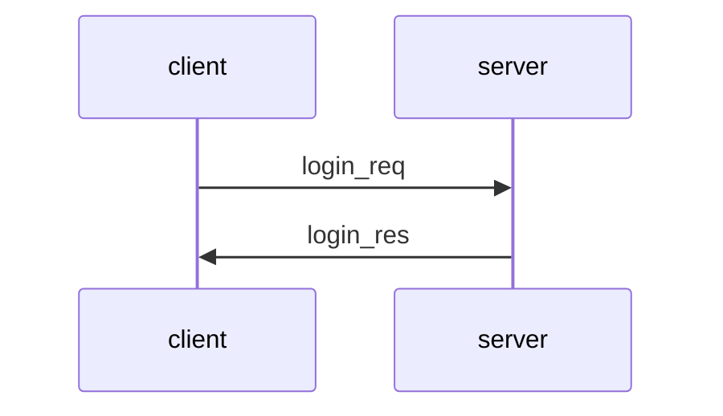
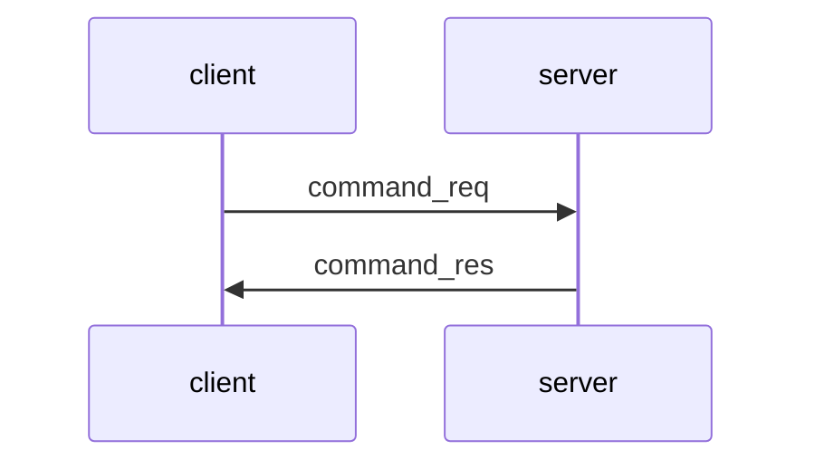
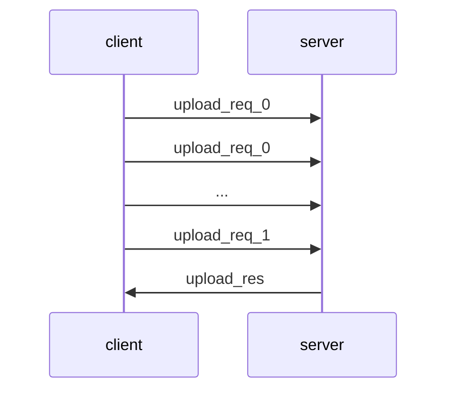
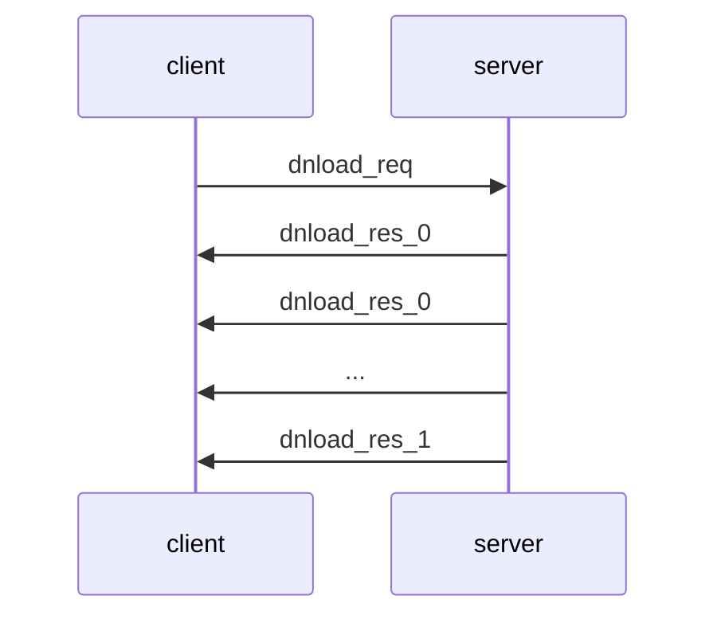

# Simple File Transfer v0.5

This document specifies version 0.5 of the Simple File Transfer (SiFT) protocol. SiFT can be used by a client to send file commands to a server, which executes those commands. SiFT supports the following 7 commands:

- __pwd__ --> Print current working directory: Returns to the client the name of the current working directory on the server.
- __lst__ --> List content of the current working directory: Returns to the client the list of files and directories in the current working directory on the server. 
- __chd__ --> Change directory: Changes the current working directory on the server. The name of the target directory is provided as an argument to the chd command.
- __mkd__ --> Make directory: Creates a new directory on the server. The name of the directory to be created is provided as an argument to the mkd command.
- __del__ --> Delete file or directory: Deletes a file or a directory on the server. The name of the file or directory to be deleted is provided as an argument to the del command.
- __upl__ --> Upload file: Uploads a file from the client to the server. The name of the file to be uploaded is provided as an argument to the upl command and the file is put in the current working directory on the server.
- __dnl__ --> Download file: Downloads a file from the current working directory of the server to the client. The name of the file to be downloaded is provided as an argument to the dnl command.

SiFT allows the client and the server to communicate via a network and execute the above commands remotely. It assumes that the client and the server uses the TCP/IP protocol to establish a connection and to send data reliably to each other. The SiFT v0.5 server must listen and accept client connection requests on TCP port 5150.

**Important notice:** SiFT v0.5 does not provide security for the client-server communications, so it should only be used on trusted networks.

## Overview of sub-protocols

SiFT v0.5 has the following sub-protocols: Message Transfer Protocol (MTP), Login Protocol, Commands Protocol, Upload Protocol, and Download Protocol. The following figure shows how these sub-protocols are related to each other: 

```
  +--------------+  +-----------------+  +---------------+  +-----------------+
  |Login Protocol|  |Commands Protocol|  |Upload Protocol|  |Download Protocol|
  +--------------+  +-----------------+  +---------------+  +-----------------+
  +---------------------------------------------------------------------------+
  |                     Message Transfer Protocol (MTP)                       |
  +---------------------------------------------------------------------------+
```

SiFT messages are carried by the Message Transfer Protocol (MTP). The Login Protocol is used to authenticate the client to the server via a username / password mechanism right after the establishment of a connection between them. After the Login Protocol, the Commands Protocol is used to send file commands of the client to the server and responses to those commands. Moreover, the upload command is followed by the execution of the Upload Protocol, which is responsible for the actual upload of the selected file to the server, and the download command is followed by the execution of the Download Protocol, which is responsible for the actual download of the selected file from the server.

## SiFT v0.5 Message Transfer Protocol 

All SiFT v0.5 MTP messages has the following format:

```
	+---+---+---+---+---+---+---+---+---+---+---+---+---+---+---+---+
	|  ver  |  typ  |  len  |                                       |
	+---+---+---+---+---+---+                                       +
	|                                                               |
	+                                                               +
	|                                                               |
	.                                                               .
	.                             payload                           .
	.                                                               .
	|                                                               |
	+                                                               +
	|                                                               |
	+               +---+---+---+---+---+---+---+---+---+---+---+---+
	|               |
	+---+---+---+---+
```

SiFT v0.5 MTP messages have a 6-byte header that consists of the following fields:

- __ver__: A 2-byte _version number_ field, where the first byte is the major version (i.e., 0 in case of v0.5) and the second byte is the minor version (i.e., 5 in case of v0.5). This means that messages conforming this specification must start with the byte sequence `00 05`.
- __typ__: A 2-byte _message type_ field that specifies the type of the payload in the message. The following message types are supported by SiFT v0.5:
	- `00 00` : _login_req_ (login request)
	- `00 10` : _login_res_ (login response)
	- `01 00` : _command_req_ (command request)
	- `01 10` : _command_res_ (command response)
	- `02 00` : _upload_req_0_ (upload request containing a file fragment)
	- `02 01` : _upload_req_1_ (upload request containing the last file fragment)
	- `02 10` : _upload_res_ (upload response)
	- `03 00` : _dnload_req_ (download request)
	- `03 10` : _dnload_res_0_ (download response containing a file fragment)
	- `03 11` : _dnload_res_1_ (download response containing the last file fragment)
- __len__: A 2-byte _message length_ field that contains the length of the entire message (including the header) in bytes (using big endian byte order).

The values for the message types are defined according to the following concpet:
- The first byte encodes the type of the interaction between the client and the server (i.e., `00` for login, `01` for commands, `02` for upload, and `03` for download).
- The first nibble of the second byte specifies whether the message is a request (i.e., a message sent from the client to the server) or a response (i.e., a message sent from the server to the client). Requests always have `0`, whereas responses always have `1` in this nibble.
- The second nibble of the second byte differentiates sub-types of a given message type. This is relevant only for upload request and  download response messages. Files are uploaded to and downloaded from the server in fragments and sub-types are used to indicate if a message contains a fragment that will be followed by other fragments (value `0`) or the last fragment of the file (value `1`), which will not be followed by further fragments. 

The header is followed by the payload of any length.

## SiFT v0.5 Login Protocol

The SiFT v0.5 Login Protocol is responsible for authenticating the client to the server with a username and password pair, which is sent to the server in a login request message. The server should not store client passwords in cleartext, but it should rather store password hashes, and verify the password in the incoming login request by hashing it and comparing it to the stored password hash of the user identified by the username in the login request. In addition, to prevent dictionary attacks on passwords, the server should use a secure password hashing algorithm, such as PBKDF2, scrypt, or Argon2.

### Message exchange

The message exchange of the Login Protocol is shown in the figure below:



The Login Protocol consists of 2 message transfers. First, the client must send a login request (login_req) to the server, and after that, the server must send a login response (login_res) to the client. If the server receives another type of message when it expects a login request, or the client receives another type of message when it expects a login response, then the connection between the client and the server must be closed. Closing the connection is initiated by the receiving party that encountered the offending message.

### Message formats

The Login Protocol is a text-based protocol, which means that message payloads are human readable texts. All payloads must be encoded in UTF-8 coding in this version of the protocol.

_login_req_

The format of the login request message (MTP type `00 00`) is the following:

```
<username>'\n'
<password>
```

where `'\n'` is the new line character. Thus, the `'\n'` character serves as a delimiter that separates the fields of the message. The fields are specified as follows:

- `<username>` is a string, the value of which is the username of the user attempting to log in.
- `<password>` is a string, the value of which is the password of the user attempting to log in.

_login_res_

The format of the login response message (MTP type `00 10`) is the following:

```
<request_hash>
```

where 

- `<request_hash>` is a hexadecimal number converted to a string, the value of which is the SHA-256 hash of the payload of the login request message converted to a byte string.

### Processing

The client should input the username and the password from the user to fill in the `<username>` and `<password>` fields of the login request. The login request is then handed over to the MTP protocol entity of the client in order to send it to the server.

Once the login request is sent, the client should compute the SHA-256 hash of the payload of the login request (converted to a byte string) and store it for the purpose of later verifications.

When the server receives the login request message, it must check the username and password received, by computing the password hash of the password and comparing it to the password hash stored by the server for the given username. It is not part of this specification to define which password hash function the server should use and how; this is left for implementations. It is recommended, however, to follow best practices in this matter, which means that a secure password hash function, such as PBKDF2, scrypt, or Argon2, should be used with appropriate streching and salting parameters.

If the verification of the username and password fails, then the server must not respond to the client, but it must close the connection. Otherwise, if the verification succeeds, then the server must compute the SHA-256 hash of the payload of the received login request (converted to a byte string) to fill in the `<request-hash>` field of the login response, which is then handed over to the MTP protocol entity of the server in order to send it to the client.

When receiving the login response, the client must verify that the request hash in the response matches the previously computed SHA-256 hash value of the payload of the login request sent to the server. If verification fails, the client must terminate the connection.

## SiFT v0.5 Commands Protocol

The SiFT v0.5 Commands Protocol is responsible for sending the file commands of the client to the server and sending response messages to these commands. The Commands Protocol must only be used after successful login by the client to the server.

### Message exchange

The Commands Protocol  messages must be carried by the MTP protocol. The message exchange of the Commands Protocol is shown in the figure below:



The Commands Protocol consists of 2 message transfers. First, the client must send a command request (command_req) to the server, and after that, the server must send a command response (command_res) to the client. Multiple instances of the above command request - command response exchange can be executed sequentially, one after the other (each with potentially different commands, of course). When the client does not want to send any more command requests, it should close the connection. If the server receives another type of message when it expects a command request, or the client receives another type of message when it expects a command response, then the connection between the client and the server must be closed. Closing the connection is initiated by the receiving party that encountered the offending message. 

### Message formats

The Commands Protocol is a text-based protocol, which means that message payloads are human readable texts. All payloads must be encoded in UTF-8 coding in this version of the protocol.

_command_req_

The format of the command request message (MTP type `01 00`) is the following:

```
<command>'\n'
<param_1>'\n'
...
<param_n>
```

The command request consists of a `<command>` field, followed by a variable number of parameter fields `<param_1>`, `<param_2>`, ..., `<param_n>`, where the number of the parameter fields depends on the command. The fields must be separated by the `'\n'` delimiter character.

The `<command>` field can contain the following strings (without the apostrophes) in this version of the protocol: 'pwd', 'lst', 'chd', 'mkd', 'del', 'upl', 'dnl'. These strings correspond to the 7 file commands supported by the SiFT v0.5 protocol.

The pwd and lst commands have no paramters. The other commands must have the following parameters:
- chd (change working directory) command:
	-  `<param_1>` is a string, the value of which is the name of the directory to change to on the server. Path names may be supported by implementations, but this is not mandatory. If path names are not supported, then this field should contain the name of a directory within the current working directory, or '..' (without apostrophes) for moving up in the directory hierarchy. Implementations should pay attantion to prevent moving outside of the root directory associated with the currently logged in user.
-  mkd (make directory) command:
	-  `<param_1>` is a string, the value of which is the name of the directory to be created on the server. Path names may be supported by implementations, but this is not mandatory. If path names are not supported, then the new directory with the given name is created inside the current working directory. If a directory with the same name already exists, then the mkd command should fail. Implementations should pay attantion to prevent creating a new directory outside of the root directory associated with the currently logged in user.
-  del (delete file or directory) command:
	-  `<param_1>` is a string, the value of which is the name of the file or directory to be deleted on the server. Path names may be supported by implementations, but this is not mandatory. If path names are not supported, the file or directory of the given name inside the current working directory is deleted. Directories should only be deleted if they are empty, otherwise the del command should fail. Implementations should pay attantion to prevent deleting a file or directory outside of the root directory associated with the currently logged in user.
-  upl (upload file) command:
	-  `<param_1>` is a string, the value of which is the name of the file to be uploaded on the server. Path names may be supported by implementations, but this is not mandatory. If path names are not supported, the file is uploaded into the current working directory on the server and the created file gets the given name. Only file upload is supported, directories cannot be uploaded by this version of the protocol. Implementations should pay attantion to prevent uploading a file outside of the root directory associated with the currently logged in user.
	-  `<param_2>` is an unsigned integer converted to a string, the value of which is the size of the file to be uploaded in bytes.
	-  `<param_3>` is a hexadecimal number converted to a string, the value of which is the SHA-256 hash of the content of the file to be uploaded.
- dnl (download file) command:
	- `<param_1>` is a string, the value of which is the name of the file to be downloaded from the server. Path names may be supported by implementations, but this is not mandatory. If path names are not supported, the file of the given name in the current working directory on the server is downloaded to the client. Only file download is supported, directories cannot be downloaded by this version of the protocol. Implementations should pay attantion to prevent downloading a file from a directory outside of the root directory associated with the currently logged in user.

_command_res_

The format of the command response message (MTP type `01 10`) is the following:

```
<command>'\n'
<request_hash>'\n'
<result_1>'\n'
...
<result_n>
```

Every command response contains the same `<command>` field as the one in the corresponding command request and a `<request_hash>` field that contains a hexadecimal number converted to a string, the value of which is the SHA-256 hash of the corresponding command request converted to a byte string. In addition, the command response contains a variable number of result fields  `<result_1>`, `<result_2>`, ..., `<result_n>`, where the number of the result fields depends on the command and the actual result of the operation. The fields must be separated by the `'\n'` delimiter character.

The commands pwd, lst, chd, mkd, and del may fail on the server for various reasons, in wich case the `<result_1>` field of the corresponding command response must be the string 'failure' (without the apostrophes) and the `<result_2>` field must contain a string indicating the casue of the failure (i.e., sort of an error message).

The commands upl and dnl may be rejected by the server for various reasons (e.g., the file to be uploaded is too large, the file to be downloaded does not exist, etc.), in which case the `<result_1>` field of the corresponding command response must be the string 'reject' (without the apostrophes) and the `<result_2>` field must contain a string indicating the casue of the rejection (i.e., sort of an error message).

If the commands pwd, lst, chd, mkd, and del did not fail on the server, then the `<result_1>` field of the corresponding command response must be the string 'success' (without the apostrophes). If the commands upl and dnl were not rejected by the server, then the `<result_1>` field of the corresponding command response must be the string 'accept' (without the apostrophes). Besides indicating success or accept, command responses to the pwd, lst, and dnl commands have further return values as follows:
- pwd command:
	- `<result_2>` is a string, the value of which is the path of the current working directory on the server.
- lst command:
	-  `<result_2>` is string, the value of which is the Base64 encoding of the listing of the content of the current working directory on the server.
- dnl command
	-  `<result_2>` is an unsigned integer converted to a string, the value of which is the size of the file to be downloaded in bytes.
	-  `<result_3>` is a hexadecimal number converted to a string, the value of which is the SHA-256 hash of the content of the file to be downloaded.

### Processing

The processing of the commands at the server and their results at the client is fairly straightforward and it is largely left to the implementations. A general rule that must be respected by implementations is that each command response must contain the SHA-256 hash of the corresponding command request (converted to a byte string) in the `<request_hash>` field of the response, and clients must verify this. If this verification fails, the client must close the connection. Other than that, failed or rejected operations should not crash the server or the client, and the connection should not be closed, but  preferably, only an error message should be printed on the client or server console.

Another important requirement to satisfy is that implementations must ensure that users cannot perform file operations outside their root directory on the server.

Note that the commands upl and dnl do not actually perform the file upload and download operation itself: they only prepare the actual file upload and download operations which are handled by the Upload and Download Protocols, respectively. These protocols are specified later in this document. So essentially, when an upload or download command is rejected, it means that the server is not ready for the given operation (for whatever reason), and when these commands are accepted, the server is ready, and it proceeds to the Upload or Download Protocol, and the client should do the same. 

## SiFT v0.5 Upload Protocol

The SiFT v0.5 Upload Protocol is responsible for executing an actual file upload operation. It must only be used by the server after sending an 'accept' response to an upl command in the Commands Protocol, and it must only be used by the client after receiving an 'accept' response to an upl command in the Commands Protocol.

### Message exchange

The Upload Protocol  messages must be carried by the MTP protocol. The message exchange of the Upload Protocol is shown in the figure below:



The Upload Protocol consists of 2 or more message transfers, depending on the number of file fragments to be uploaded. The client typically does not upload the entire file in a single message, but it divides the file into fragments and uploads the fragements in upload request messages. There are two types of upload requests: _upload_req_0_ (MTP type `02 00`) and _upload_req_1_ (MTP type `02 01`). File fragments that are followed by further file fragments are uploaded in _upload_req_0_ messages, and the last file fragment, which is not followed by any more file fragment, is uploaded in an _upload_req_1_ message at the end. The server learns that the upload is complete by the fact of receiving an _upload_req_1_ message, and then it must send an upload response (_upload_res_) to the client.

Note that if the file is small and the entire file fits in a single fragment, then the client sends only a single _upload_req_1_ message, and the server responds with an _upload_res_ messages, and this completes the entire upload operation. 

The fragment size cannot be negotiated in this version of the protocol, therefore implementations conforming this specification must use the fixed fragment size of 1024 bytes.

### Message formats

_upload_req_0_ and _upload_req_1_

Both types of upload request messages (MTP types  `02 00` and  `02 01`)  contain the raw bytes of the file fragment carried in the message. These messages have no further structuring.

_upload_res_

The upload response message (MTP type `02 10`) has a text-based format, i.e., it contains human readable text, encoded in UTF-8 coding. The message has 2 fields, separeted by the `'\n'` delimiter character:

```
<file_hash>'\n'
<file_size>
```

where:
- `<file_hash>` is a hexadecimal number converted to a string, the value of which is the SHA-256 hash of the content of the file that has been uploaded to the server.
- `<file_size>` is an unsigned integer converted to a string, the value of which is the size of the file uploaded to the server in bytes.

### Processing

The client splits the file to be uploaded into fragments of the specified size, and uploads these fragments sequentially in upload request messages, such that the last fragment is uploaded in a message of type _upload_req_1_, while all preceeding fragments (if any) are uploaded in messages of type _upload_req_0_. During this operation, the client should also compute the size of the uploaded file and its SHA-256 hash value.

The server receives the upload request messages and saves their content into a file the name of which was specified in the upl command request that triggered the use of the Upload Protocol in the first place. When the server receives an _upload_req_1_ message, it knows that the upload is complete. During the upload operation, the server computes the size of the file received and its SHA-256 hash value. It must then send an upload response message where the `<file_hash>` and the `<file_size>` fields contain the computed file  hash and file size values.

Finally, when the client receives the upload response message, it must verify that the file hash received matches the one previously computed during the upload. If the verification fails, the client should close the connection with the server.

## SiFT v0.5 Download Protocol

The SiFT v0.5 Download Protocol is responsible for executing an actual file download operation. It must only be used by the server after sending an 'accept' response to a dnl command in the Commands Protocol, and it must only be used by the client after receiving an 'accept' response to a dnl command in the Commands Protocol.

### Message exchange

The Download Protocol  messages must be carried by the MTP protocol. The message exchange of the Download Protocol is shown in the figure below:



The Download Protocol consists of 2 or more message transfers, depending on the number of file fragments to be downloaded. The server typically does not download the entire file in a single message to the client, but it divides the file into fragments and downloads the fragements in download response messages. There are two types of download responses: _dnload_res_0_ (MTP type `03 10`) and _dnload_res_1_ (MTP type `03 11`). File fragments that are followed by further file fragments are downloaded in _dnload_res_0_ messages, and the last file fragment, which is not followed by any more file fragment, is downloaded in a _dnload_res_1_ message at the end. The client learns that the download is complete by the fact of receiving a _dnload_res_1_ message. Note that if the file is small and the entire file fits in a single fragment, then the server sends only a single _dnload_res_1_ message, and this completes the entire download operation. 

Before the actual download of the file, the client must indicate if it is ready for receiving the file or prefers cancelling the file download in the _dnload_req_ message sent to the server at the beginning of the Download Protocol. The server must not start sending the file fragments until it receives this indication, and it must start sending the file fragments if the client indicates that it is ready, otherwise it must cancel the file download operation and must not send anything to the client.

As with the Upload Protocol, the fragment size cannot be negotiated in this version of the Download Protocol, therefore implementations conforming this specification must use the fixed fragment size of 1024 bytes.

### Message formats

_dnload_req_

The download request message (MTP type `03 00`) has a text-based format, i.e., it contains human readable text, encoded in UTF-8 coding. The message contains a single field, which has the value 'ready' or 'cancel' (without the apostrophes). 'ready' means that the client is ready for the download, whereas 'cancel' means that, despite the fact that the download request was accepted  by the server, the client does not want to proceed, and it cancels the operation.

_dnload_res_0_ and _dnload_res_1_

Both types of download response messages (MTP types  `03 10` and  `03 11`)  contain the raw bytes of the file fragment carried in the message. These messages have no further structuring.

### Processing

When the client receives a download response in the Commands Protocol, it learns from that response the size and hash of the file to be downloaded. Based on these, it may decide to proceed with the download or cancel it (e.g., it may ask the user if he/she wants to download the file given its size and its hash). The decision of the client is sent to the server in the _dnload_req_ message.

When the server receives the _dnload_req_ message, it inspects its content and proceeds accordingly. If the download operation is not cancelled, the server splits the file to be downloaded into fragments of the specified size, and downloads to the client these fragments sequentially in download response messages, such that the last fragment is downloaded in a message of type _dnload_res_1_, while all preceeding fragments (if any) are downloaded in messages of type _dnload_res_0_. 

The client receives the download response messages and saves their content into a file. When the client receives a _dnload_res_1_ message, it knows that the download is complete. During the download operation, the client computes the size of the file received and its SHA-256 hash value. It must then verify that the file hash received matches the one previously received in the Commands Protocol as part of the server's response to the client's download request that triggered this download in the first place. If the verification fails, the client may close the connection with the server or simply notify the user that the file received has a hash value that does not match the one previously computed by the server.

## Examples

### Login Protocol

The following is an example for a login request message, when a user with username 'alice' and password 'aaa' is logging in: 

```
alice\n
aaa
```

This login request payload may be carried by the following MTP message (byte string printed in hex format, arranged in lines, and tagged with the field names (and field sizes), but in implementations this should be a continuous sequence of bytes):

```
HDR (6): 	00050000000f
BDY (9): 	616c6963650a616161
```

The following is an example for the corresponding login response message:

```
f76fc58d4ed409c8c1a890a8faaaf51e810d8e4795dcf54c62a09d29eecc114f
```

This hexadecimal number is the SHA-256 hash of the login request (converted to a byte string) in hex format represented as a string.

This login response payload may be carried by the following MTP message (byte string printed in hex format, arranged in lines, and tagged with the field names (and field sizes), but in implementations this should be a continuous sequence of bytes):

```
HDR (6): 	000500100046
BDY (64): 	66373666633538643465643430396338
			63316138393061386661616166353165
			38313064386534373935646366353463
			36326130396432396565636331313466
```

### Commands Protocol

Example for a command request, when the user changes to directory `testdir`:

```
chd\n
testdir
```

and its corresponding command response:

```
chd\n
919963f263c2d6889fb91f9fea17abc5f11aa112b9a46a71c3e179ae43c617d3\n
failure\n
Directory does not exist
```

The command response contains the command (chd) and the SHA-256 hash of the command request above. The operation failed, and the reason of the failure is also contained in the message as a string.

The following is an example for a command request:

```
mkd\n
testdir
```

that succeeded:

```
mkd\n
f372bda92320b01219cfc7e8a3681bddf841490dd625907fb612c482aedd8deb\n
success
```

The user can list the directory content by sending the following command request:

```
lst
```

and he/she receives the following command response:

```
lst\n
274088a0cde8b724153ed9396a946299f10c19c6cf593a19ce57c52580a32dcb\n
success\n
dGVzdGRpci8=
```

In the response, the directory listing is encoded in Base64. After decoding, we would get `testdir/` (i.e., the current working directory contains a single sub-directory called `testdir`).

All these command request and command response messages are carried in MTP messages. E.g., the command responses above is carried by the following MTP message (byte string printed in hex format, arranged in lines, and tagged with the field names (and field sizes)):

```
HDR (6): 	00050110005f
BDY (89): 	6c73740a323734303838613063646538
			62373234313533656439333936613934
			36323939663130633139633663663539
			33613139636535376335323538306133
			326463620a737563636573730a644756
			7a644752706369383d
```

### Example for an upload 

The following is an example for an __upl__ command request, when the user wants to upload a file named `test_2.txt` with size 2350 bytes and hash value `b1a8b752...`:

```
upl\n
test_2.txt\n
2350\n
b1a8b752fef9179e7691cf63104ebb913bbbc1b55040af3b379ab3608ff1881b
```

The corresponding __upl__ command response is:

```
upl\n
3ca3dbad248f619e6388d5ec32f8ffe38921291fe08ef2d284c5e432392d31a7\n
accept
```

Then the file is uploaded in 1024-byte fragments by the Upload Protocol. The last fragment (only 302 bytes) is the following:

```
eam, believes the group only cooperates with the creators of Flame and Stuxnet from a position of superiority: "Equation Group are definitely the masters, and they are giving the others, maybe, bread crumbs. From time to time they are giving them some goodies to integrate into Stuxnet and Flame."[11]\n
```

With this, the upload is complete, and the server sends an upload response message:

```
b1a8b752fef9179e7691cf63104ebb913bbbc1b55040af3b379ab3608ff1881b\n
2350
```

### Example for a download 

The following is an example for a __dnl__ command request, when the user wants to download a file named `test_2.txt`:

```
dnl\n
test_2.txt
```

and its corresponding __dnl__ command response:

```
dnl\n
e0c810c0b393712e6438eec29b7fbf88f960fdd229da193e9d139099b6c58f58\n
accept\n
2350\n
b1a8b752fef9179e7691cf63104ebb913bbbc1b55040af3b379ab3608ff1881b
```

If the user wants to proceed, then the following download request is sent:

```
ready
```

The file is then downloaded by the Download Protocol in 1024-byte fragments. The last fragment (only 302 bytes) downloaded is the following:

```
eam, believes the group only cooperates with the creators of Flame and Stuxnet from a position of superiority: "Equation Group are definitely the masters, and they are giving the others, maybe, bread crumbs. From time to time they are giving them some goodies to integrate into Stuxnet and Flame."[11]\n
```

And with this, the download is complete.